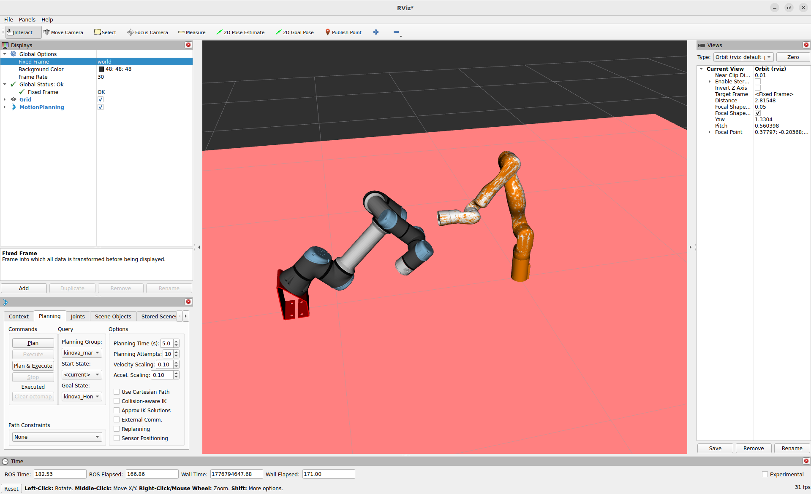

# ur5_gen3_dual_setup

This project provides a dual robot setup for:

* **Universal Robots UR5** (ROS 2 Jazzy + MoveIt 2)
* **Kinova Gen3** using **ros2_kortex**

The setup is intended for simulation and coordinated MoveIt 2 planning between both robots.

---

## Prerequisites

Before using this project, make sure the following dependencies are installed.

### [Optional]
For reproducibility use base docker image:
```bash
docker pull rocm/dev-ubuntu-24.04:7.2.2-complete
```

### 1. Install Ur5 driver and description

Follow the official installation instructions from the Universal Robots ROS 2 driver repository.

**Link:**

> [https://github.com/UniversalRobots/Universal_Robots_ROS2_Driver.git]
> [https://github.com/UniversalRobots/Universal_Robots_ROS2_Description]

---

### 2. Install Kinova driver

Follow the official installation instructions from the Kortex ROS 2 repository.

**Link:**

> [https://github.com/Kinovarobotics/ros2_kortex]

---

### 3. Install MoveIt Visual Tools

```bash
sudo apt install ros-jazzy-moveit-visual-tools
```

---


## Simulation Launch Instructions

To run the full dual robot simulation, use **three separate terminals**.

> Important: each terminal must use a different `GZ_PARTITION` value.

This prevents Gazebo transport conflicts between the launched systems.

Example:

### Terminal 1

```bash
export GZ_PARTITION=partition_1
```

Launch UR5 control:

```bash
ros2 launch dual_ur_bringup my_control.launch.py \
  namespace:=/ur \
  tf_prefix:=ur_
```

---

### Terminal 2

```bash
export GZ_PARTITION=partition_2
```

Launch Kinova Gen3 control:

```bash
ros2 launch kortex_dual my_control.launch.py \
  namespace:=/kinova \
  tf_prefix:=kinova_
```

---

### Terminal 3

Launch the dual MoveIt 2 setup:

```bash
ros2 launch dual_ur_bringup dual_moveit2.launch.py
```

## Visualization



---

## Notes

* Make sure both robot drivers are correctly sourced in your ROS 2 environment.
* Verify that all required packages are built in your workspace.
* Ensure namespaces and TF prefixes are correctly separated to avoid conflicts.

---

## Repository Structure

```text
ur5_gen3_dual_setup/
├── dual_ur_bringup/
├── kortex_dual/
├── moveit configuration files
└── supporting launch/config packages
```

---

## Author

Antonio Skara

